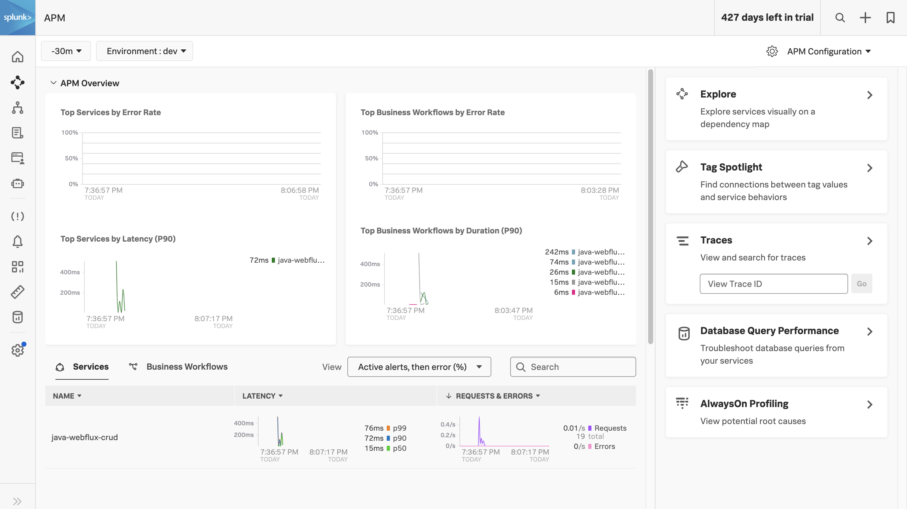
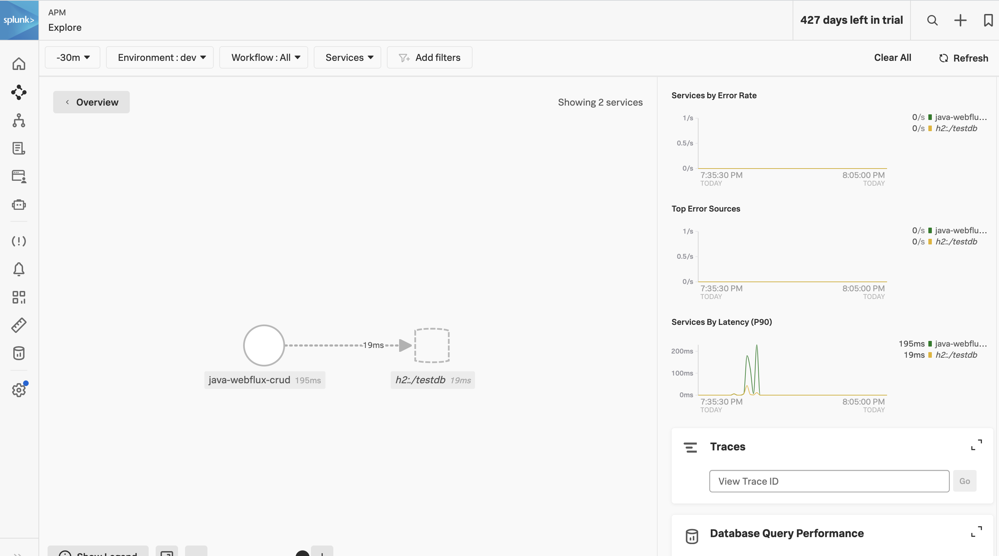
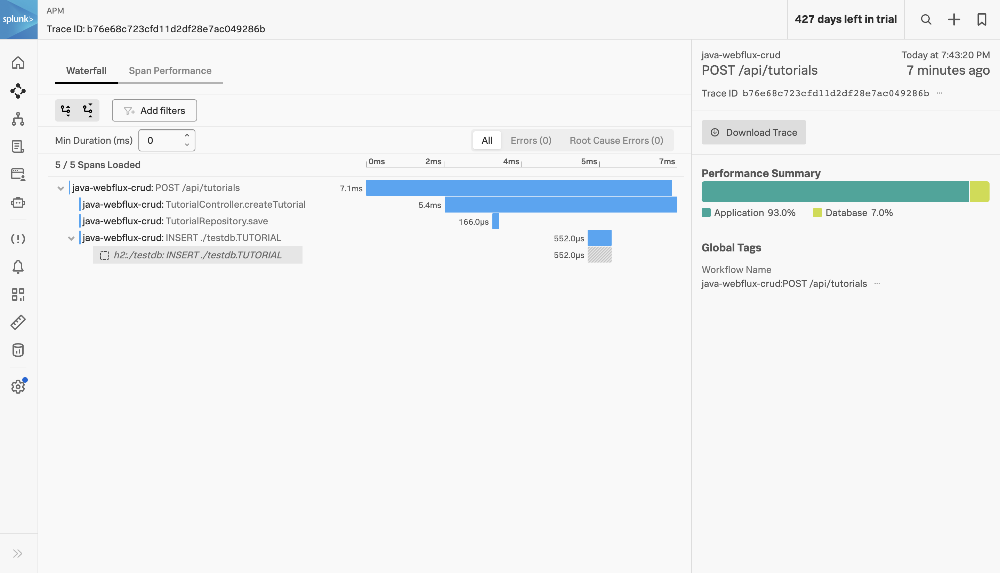

# Splunk Observability Sample Application

This sample application provides users to quickly get traces into the O11y platform. The CRUD application uses 
webflux architecture to understand the traces when instrumented.

## Compiler Version

```bash
➜  Splunk-Java-Webflux-CRUD git:(master) ✗ java --version
java 20.0.1 2023-04-18
Java(TM) SE Runtime Environment (build 20.0.1+9-29)
Java HotSpot(TM) 64-Bit Server VM (build 20.0.1+9-29, mixed mode, sharing)

➜  Splunk-Java-Webflux-CRUD git:(master) ✗ mvn -version
Apache Maven 3.9.4 (dfbb324ad4a7c8fb0bf182e6d91b0ae20e3d2dd9)
Maven home: /usr/local/Cellar/maven/3.9.4/libexec
Java version: 20.0.1, vendor: Homebrew, runtime: /usr/local/Cellar/openjdk/20.0.1/libexec/openjdk.jdk/Contents/Home
Default locale: en_SG, platform encoding: UTF-8
OS name: "mac os x", version: "13.4.1", arch: "x86_64", family: "mac"
```

## To Run

1. Ensure OTEL collector is running in the backend.
2. Build application `mvn clean package`
3. Invoke start script `./start.sh`


## APM


